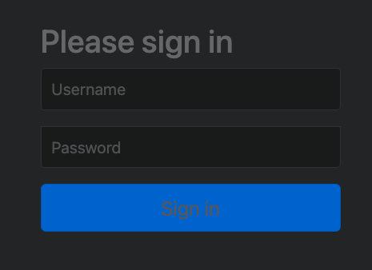
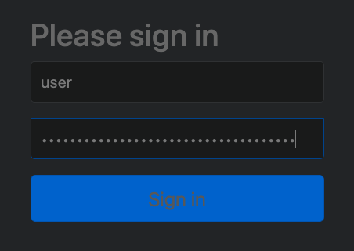
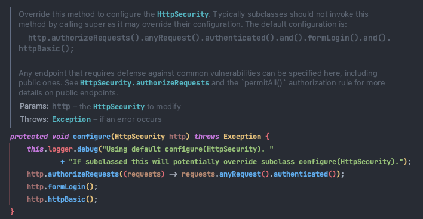
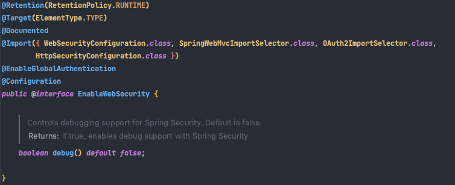
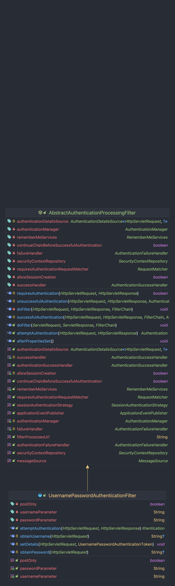
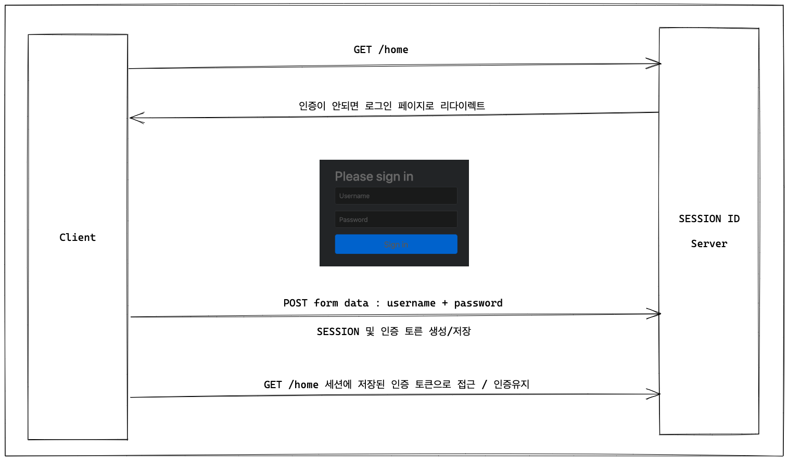
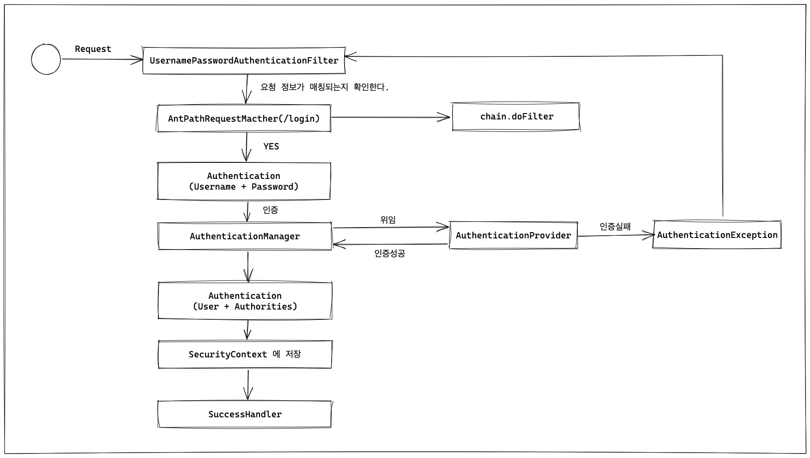

# 스프링 시큐리티 기본 API & Filter 이해

## 인증 API - 01. 프로젝트 구성 및 의존성 추가

[[01-01] : 시큐리티 프로젝트 구성](https://github.com/Study-Spring-Repo/spring-security-basic/commit/3bc8917d1469fd11655d72a9de7f98605f1d123b)

- 의존성을 추가한다.

```
implementation 'org.springframework.boot:spring-boot-starter-security:2.5.3'
```
- 기존에 컨트롤러를 통해서 접근하면 아무런 일도 일어나지 않았었다.
- 하지만 security 의존을 추가하고 나서부터 login 페이지가 나온다.
  - 콘솔에 security password가 출력 된다.



- ID : user
- PW : 콘솔 security password




> 인증 API - 01. 프로젝트 구성 및 의존성 추가
> 
> - 스프링 시큐리티 의존성 추가 시 발생
>   - 서버가 가동시
>     - 스프링 시큐리티의 초기화 작업 및 보안 설정이 이루어진다.
>   - 별도의 설정이나 구현 없이
>     - 기본적인 웹 보안 기능이 현재 시스템에 연동되어 작동함
>       - 모든 요청은 인증 되어야 접근 가능
>       - 인증 방식은 "폼 로그인 방식", "httpBasic" 로그인 방식을 제공
>       - 기본 로그인 페이지 제공
>       - 기본 계정 한개 제공 (user / password(랜덤문자열))
> - 문제점
>   - 계정 추가, 권한 추가, DB 연동
>   - 기본적인 보안 기능 외에 
>     - 시스템에서 필요로 하는 더 세부적이고 추가적인 보안 기능이 필요

## 인증 API - 02. 사용자 정의 보안 기능 구현

[[01-02] : 사용자 정의 보안 기능](https://github.com/Study-Spring-Repo/spring-security-basic/commit/6c3c48b0da7ad3c6eb488620850c995e069f34ad)

> 인증 API - 02. 사용자 정의 보안 기능 구현
> 
> - WebSecurityConfigurerAdapter ⭐️
>   - 스프링 시큐리티의 웹 보안 기능 초기화 및 설정
> - SecurityConfig
    >   - 사용자 정의 보안 설정 클래스
> - HttpSecurity
    >   - 세부적인 보안 기능을 설정할 수 있는 API 제공
>   - 인증 API
>     - http.formLogin()
>     - http.login()
>     - http.csrf()
>     - ...
>   - 인가 API
>     - http.authorizeRequests()
>       - .antMatchers(/admin)
>       - .hasRole(USER)
>       - .permitAll()
>       - ...
    

- 아무런 설정없이 security 의존 추가만으로도 보안 기능이 설정되는 이유
    - WebSecurityConfigurerAdapter 클래스 내에 configure 메서드 때문이다.
  


- @EnableWebSecurity
  - 각종 웹 보안을 불러온다.
  


- SecurityConfig
  - WebSecurityConfigurerAdapter를 상속 받아 configure를 재정의한다.
```java
@Configuration
@EnableWebSecurity
public class SecurityConfig extends WebSecurityConfigurerAdapter {

    @Override
    protected void configure(HttpSecurity http) throws Exception {

        // 인가 정책
        http.authorizeRequests()
                .anyRequest()
                .authenticated();

        // 인증 정책
        http.formLogin();
    }
}
```
- application.properties 에 메모리 사용자로 user와 password를 등록할 수 있다.

```properties
# application.properties
spring.security.user.name=user
spring.security.user.password=1111
```

## 인증 API - 03. Form 인증

[[01-03] : Form 인증 로그인 기능](https://github.com/Study-Spring-Repo/spring-security-basic/commit/c0b027e25ea8374d9d378073008bde8c14484f33)

> 인증 API - 03. Form 인증 기능
> 
> `http.formLogin()` : Form 로그인 인증 기능이 작동한다.
>
```java
@Override
protected void configure(HttpSecurity http) throws Exception {
    
    // 인증 정책
    http.formLogin()
            // 사용자 정의 로그인 페이지
            .loginPage("/loginPage")

            // 로그인 성공 후 이동 페이지
            // 이 경로는 누구나 접근 가능하도록 해야 한다.
            .defaultSuccessUrl("/")
        
            // 로그인 실패 후 이동 페이지
            .failureUrl("/login")
        
            // 아이디 파라미터명 설정
            .usernameParameter("userId")
        
            // 패스워드 파라미터명 설정
            .passwordParameter("passwd")
        
            // 로그인 Form Action Url
            .loginProcessingUrl("/login_proc")

            // 로그인 성공 후 핸들러
            // AuthenticationSuccessHandler
            .successHandler((request, response, auth) -> {
                System.out.println("authentication : " + auth.getName());
                response.sendRedirect("/");
            })
            
            // 로그인 실패 후 핸들러
            //AuthenticationFailureHandler
            .failureHandler((request, response, exception) -> {
                System.out.println("exception : " + exception.getMessage());
                 response.sendRedirect("/login");
            })
            .permitAll();
}
```

## 인증 API - 04. 로그인 인증 필터 : UsernamePasswordAuthenticationFilter

[[01-04] : 로그인 인증 필터 UsernamePasswordAuthenticationFilter](https://github.com/Study-Spring-Repo/spring-security-basic/commit/b40f736b7a31d769cd0ebc73f78448a247744635)







## 인증 API - 05. Logout